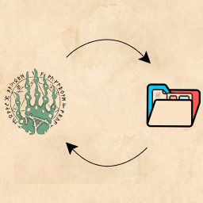
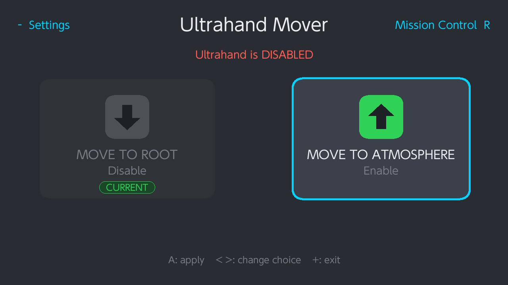
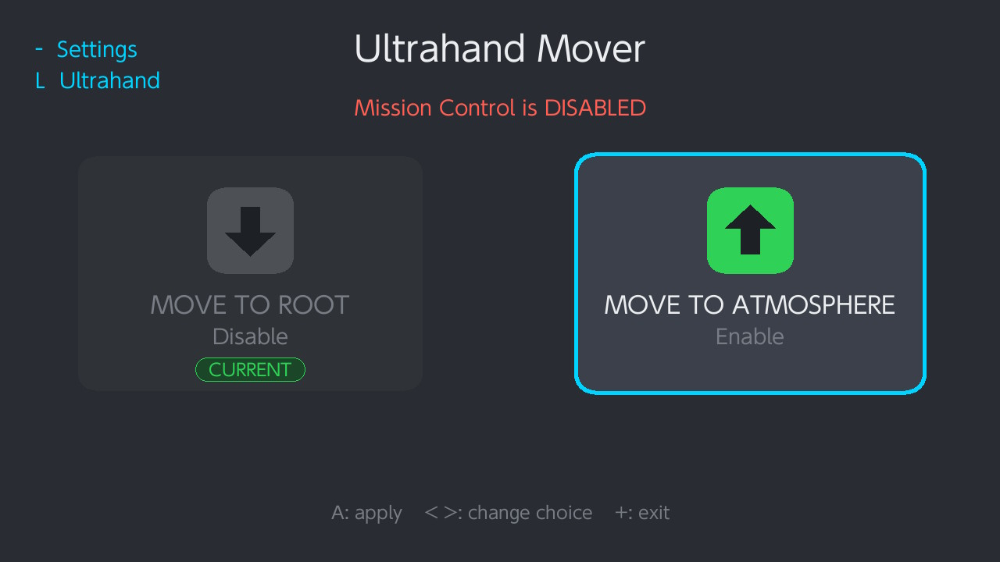
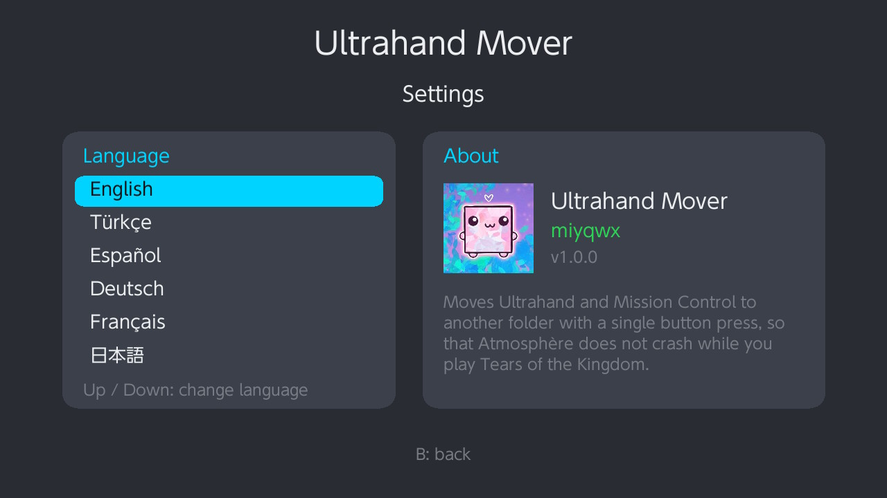

<div align="center">



# Ultrahand Mover

**Move Ultrahand and Mission Control out of `atmosphere/contents` with a single button press, so games like Tears of the Kingdom can boot.**

</div>

---

## Why

Some sysmodules stop certain games from launching. With Ultrahand or Mission Control installed, *The Legend of Zelda: Tears of the Kingdom* can fail to boot or crash Atmosphère on startup.

The usual fix is to pull those folders out of `atmosphere/contents` by hand every time you want to play, then drag them back afterwards. Ultrahand Mover does it for you from the console itself — no PC, no SD card reader, no file manager.

## Screenshots

<div align="center">







</div>

## Features

- One button press to disable or enable — folders are moved, never deleted
- Separate pages for **Ultrahand** and **Mission Control**
- Shows the current state at a glance; the option that is already applied is greyed out
- Offers to reboot right after a move, so the change takes effect immediately
- Instant moves: files are renamed in place when possible instead of being copied
- Skips cleanly when a sysmodule is not installed on the console
- Editable folder list, so it works even if your setup uses different title IDs
- Writes a log file for troubleshooting
- Six interface languages

## Languages

English · Türkçe · Español · Deutsch · Français · 日本語

The language is chosen in Settings and remembered between sessions.

## Installation

1. Download `ultrahand-mover.nro` from the [Releases](../../releases) page.
2. Copy it to the `/switch/` folder on your SD card.
3. Launch it from hbmenu (the Album, held with R).

Requires Atmosphère.

## Usage

| Button | Action |
| --- | --- |
| A | Apply the selected move |
| Left / Right | Change choice |
| R | Go to the Mission Control page |
| L | Back to the Ultrahand page |
| − | Settings |
| + | Exit |

After a move the app asks whether to restart the console. Sysmodules stay loaded in memory until reboot, so answer **yes** if you want the change to take effect right away.

## Files it creates

| Path | Purpose |
| --- | --- |
| `sd:/ultrahand/` | Where Ultrahand folders are parked while disabled |
| `sd:/mission-control/` | Same, for Mission Control |
| `sd:/ultrahand/list.txt` | Folder names to move — one per line, `#` for comments |
| `sd:/ultrahand-mover.cfg` | Selected language |
| `sd:/ultrahand-mover.log` | Log of every check and move |

The default folder names are `420000000007E51A` and `420000000007E51B` for Ultrahand, and `010000000000BD00` for Mission Control. If your setup differs, edit the matching `list.txt` and press **X** in the app to reload it.

## Building from source

Install [devkitPro](https://devkitpro.org/wiki/Getting_Started) with the Switch toolchain, then the required libraries:

```
pacman -S switch-sdl2 switch-sdl2_ttf switch-sdl2_gfx switch-freetype switch-libpng switch-bzip2 switch-mesa
```

Then, in the project folder:

```
make
```

The result is `ultrahand-mover.nro`.

## Credits

- [Ultrahand Overlay](https://github.com/ppkantorski/Ultrahand-Overlay) by ppkantorski
- [Mission Control](https://github.com/ndeadly/MissionControl) by ndeadly
- [libnx](https://github.com/switchbrew/libnx) and devkitPro
- SDL2, SDL2_ttf and SDL2_gfx

This tool only moves folders around. It does not modify, patch or redistribute any of the projects above.

## License

MIT — see [LICENSE](LICENSE).
